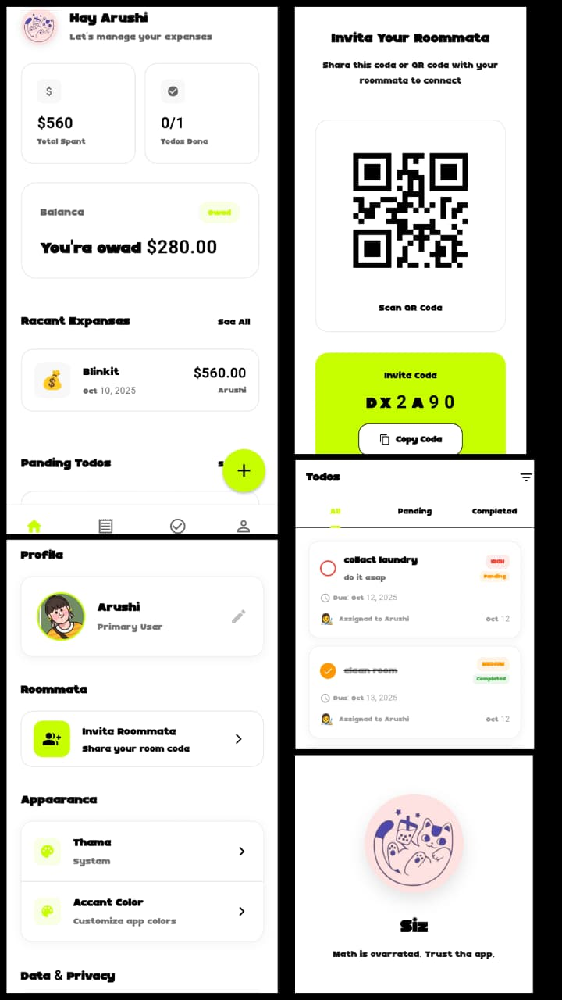

# 🐱 SIZ - Maths is so overrated, trust the app

<div align="center">
  
</div>


**Your ultimate companion app that makes living fun & easy! 🏠✨**

[](https://flutter.dev/)
[](https://firebase.google.com/)
[](https://developer.android.com/)
[](https://dart.dev/)

</div>

---

## 🎯 What is Siz?

**Siz** is a beautifully designed Flutter app that transforms the chaos of roommate living into organized, stress-free harmony. No more awkward money conversations or forgotten chores.

### ✨ Why Siz?

- 🧮 **Maths is overrated** - We handle all the calculations for you
- 🎨 **Gen Z aesthetic** - Cute, modern, and Instagram-worthy
- 🏠 **Roommate harmony** - Split expenses, share tasks, live peacefully
- 📱 **Home screen widgets** - Quick access to your todos
- 🔥 **Real-time sync** - Everything updates instantly across devices

---

## 🚀 Features

### 💰 Smart Expense Management
- **Automatic calculations** - No more mental math or calculator apps
- **Split expenses** - Fair and transparent cost sharing
- **Payment tracking** - Mark expenses as paid with visual indicators
- **Category organization** - Food, utilities, rent, and more
- **Balance summaries** - See who owes what at a glance

### ✅ Collaborative Todo Lists
- **Shared tasks** - Assign to yourself, roommate, or both
- **Priority levels** - High, medium, low priority organization
- **Due dates** - Never miss important deadlines
- **Status tracking** - Pending, in progress, completed
- **Home screen widget** - Quick access without opening the app

### 🏠 Room Management
- **Easy room creation** - Set up your shared space in seconds
- **QR code invites** - Share your room with a simple scan
- **Invite codes** - Alternative sharing method
- **Real-time updates** - Changes sync instantly

### 🎨 Beautiful Design
- **Custom fonts** - Moliga DEMO for that unique aesthetic
- **Lime/neon green theme** - Modern and vibrant
- **Circular avatars** - Choose from 9 cute avatar options
- **Custom photos** - Upload your own profile pictures
- **Smooth animations** - Delightful user experience

---

## 🛠️ Tech Stack

- **Frontend**: Flutter 3.x with Dart
- **Backend**: Firebase (Firestore, Authentication, Storage)
- **State Management**: Provider pattern
- **UI/UX**: Custom design system with animations
- **Platform**: Android (with home screen widgets)
- **Real-time**: Cloud Firestore listeners

---

## 💖 App Preview

<div align="center">



<p><i>“App that maintains your asthetics”</i></p>

</div>


---

## 🚀 Getting Started

### Prerequisites

- Flutter SDK (3.0 or higher)
- Android Studio / VS Code
- Firebase project setup
- Android device or emulator

### Installation

1. **Clone the repository**
   ```bash
   git clone https://github.com/Arrrzushi/siz.git
   cd siz
   ```

2. **Install dependencies**
   ```bash
   flutter pub get
   ```

3. **Firebase Setup**
   - Create a Firebase project
   - Enable Authentication (Email/Password, Anonymous)
   - Enable Firestore Database
   - Enable Storage
   - Download `google-services.json` and place in `android/app/`

4. **Configure Firestore Rules**
   ```bash
   firebase deploy --only firestore:rules
   ```

5. **Run the app**
   ```bash
   flutter run
   ```

---

## 🔧 Development Workflow

### 🏗️ Project Structure

```
lib/
├── main.dart                 # App entry point
├── models/                   # Data models
│   ├── expense.dart
│   ├── todo.dart
│   └── user.dart
├── providers/                # State management
│   ├── app_provider.dart
│   ├── expense_provider.dart
│   ├── theme_provider.dart
│   └── todo_provider.dart
├── screens/                  # UI screens
│   ├── home_screen.dart
│   ├── expenses_screen.dart
│   ├── todos_screen.dart
│   └── ...
├── services/                 # Business logic
│   ├── firebase_service.dart
│   ├── invite_service.dart
│   └── widget_service.dart
├── widgets/                  # Reusable components
│   ├── todo_item.dart
│   ├── expense_item.dart
│   └── ...
└── utils/                    # Utilities
    ├── constants.dart
    └── animations.dart
```

### 🔄 Development Process

1. **Feature Development**
   ```bash
   # Create feature branch
   git checkout -b feature/awesome-feature
   
   # Make changes
   # Test thoroughly
   
   # Commit changes
   git add .
   git commit -m "feat: add awesome feature"
   
   # Push and create PR
   git push origin feature/awesome-feature
   ```

2. **Testing**
   ```bash
   # Run tests
   flutter test
   
   # Run integration tests
   flutter drive --target=test_driver/app.dart
   ```

3. **Building**
   ```bash
   # Debug build
   flutter build apk --debug
   
   # Release build
   flutter build apk --release
   ```

### 🎨 Design System

- **Colors**: Lime green (#C8FF00), white, black
- **Typography**: Moliga DEMO font
- **Components**: Circular avatars, minimal cards
- **Animations**: Smooth transitions and micro-interactions

---

## 🔥 Firebase Configuration

### Firestore Rules

```javascript
rules_version = '2';
service cloud.firestore {
  match /databases/{database}/documents {
    // Users can read/write their own data
    match /users/{userId} {
      allow read, write: if request.auth != null && request.auth.uid == userId;
    }
    
    // Room members can access room data
    match /rooms/{roomId} {
      allow read, write: if request.auth != null && 
        request.auth.uid in resource.data.memberIds;
    }
    
    // Expenses and todos follow room access rules
    match /expenses/{expenseId} {
      allow read, write: if request.auth != null && 
        request.auth.uid in get(/databases/$(database)/documents/rooms/$(resource.data.roomId)).data.memberIds;
    }
  }
}
```

### Authentication Setup

1. Enable Email/Password authentication
2. Enable Anonymous authentication
3. Configure sign-in methods in Firebase Console

---

## 📱 Android Widget

Siz includes a beautiful home screen widget that shows:
- Todo count and status
- Quick access to the app
- Real-time updates

### Widget Features

- **Compact design** - Fits perfectly on home screen
- **Live data** - Shows current todo count
- **Tap to open** - Direct access to the app
- **Auto-updates** - Refreshes when data changes

---

## 🤝 Contributing

We love contributions! Here's how you can help:

1. **Fork the repository**
2. **Create a feature branch** (`git checkout -b feature/amazing-feature`)
3. **Commit your changes** (`git commit -m 'Add amazing feature'`)
4. **Push to the branch** (`git push origin feature/amazing-feature`)
5. **Open a Pull Request**

### Development Guidelines

- Follow Flutter/Dart style guidelines
- Write meaningful commit messages
- Add tests for new features
- Update documentation
- Keep the design consistent

---

## 📄 License

This project is licensed under the MIT License - see the [LICENSE](LICENSE) file for details.

---

## 🙏 Acknowledgments

- **Flutter team** for the amazing framework
- **Firebase** for the backend services
- **Gen Z** for the aesthetic inspiration
- **Roommates everywhere** for the real-world testing

---

## 📞 Support

Having issues? We're here to help!

- 🐛 **Bug Reports**: [Open an issue](https://github.com/Arrrzushi/siz/issues)
- 💡 **Feature Requests**: [Start a discussion](https://github.com/Arrrzushi/siz/discussions)
- 💬 **Questions**: [Join our community](https://github.com/Arrrzushi/siz/discussions)

---

<div align="center">

**Made with ❤️ for roommates who deserve better**

[](https://github.com/Arrrzushi/siz/stargazers)
[](https://github.com/Arrrzushi/siz/network/members)
[](https://github.com/Arrrzushi/siz/issues)

</div>
